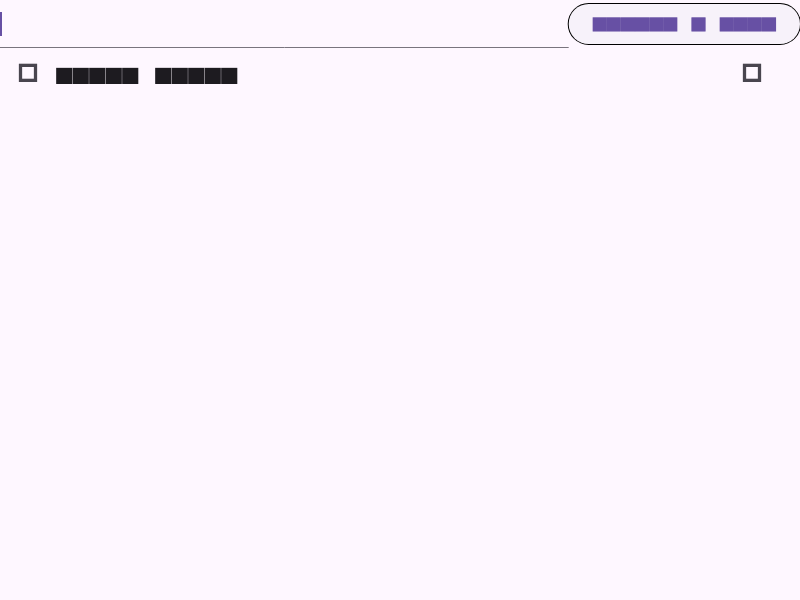

# my_todo_app

[](https://github.com/atn832/my_todo_app/actions/workflows/flutter.yml)

A Todo app in Flutter to demonstrate test driven development.



## Tests

## Running tests

```
flutter test
```

### Update screenshots

```
flutter test --update-goldens
```

### Update mocks

```
dart run build_runner build
```

## Deploying

We set up a script that runs tests before compiling the app to Android, then pretending to deploy. If the tests fail, the script aborts immediately.

```
./deploy.sh
```
